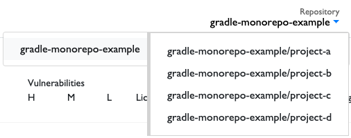

# View Dependencies in a List

CommunityBridge Security identifies vulnerable dependencies and the licenses associated with them that project repositories use. A list shows an inventory in alphabetical order of all the dependencies used in your open-source projects, and helps you gain insight into various aspects of your repository dependencies:

* Get detailed information on dependencies that are used by the project, and licenses for those dependencies. 
* Identify vulnerable dependencies in the repository and its projects, and filter by particular dependencies and languages.
* Keep dependency versions up-to-date; make sure that the dependency uses the recommended version and confirm that the recommended version remediates the vulnerability. Also confirm that the new version is backward-compatible with your repository. If the affected code is active in your repository, prioritize an update.

**Do these steps:**

1. Select **Dependencies** from the top menu.
2. Select a **repository** from the Repository drop-down list.  Only dependencies for that repository and project appear. **Summary** shows all the dependencies for the project repositories and corresponding details.   
3. Browse the list to see if a repository uses a vulnerable dependency. 
   * **Dependency** lists dependencies consecutively by dependency name. Click a **dependency** to go to the Snyk Vulnerability Database and find out more information about a dependency.
   * **Version** shows the version number of the dependent file. Before you update a dependency, investigate its impact and verify that the vulnerability is resolved by a version change. If a safe recommended version does not exist, consider removing the dependency, and use a similar dependency if a safe one is available. 
   * **Vulnerabilities** shows the CVSS score for the vulnerability: H \(HIGH\)/M \(MEDIUM\)/L \(LOW\), as well as an overall score between 0.0 and 10.0.
   * **License** shows the SPDX license identifier. Click a license **identifier** to go to the SPDX License and find out more information about a license. The SPDX License includes a full name, standardized short identifier, vetted license text, and other information about the license.
   * **CommunityBridge Funding** shows the number of CommunityBridge Funding projects that are using the dependency. The project number links to the CommunityBridge Funding project page and shows the projects.
4. \(Optional\) Click **Export as CSV** to export the data to a Comma-Separated Values \(CSV\) file, which you can open, save, or both. Here is an example snippet of an exported CSV file from the Dependencies tab:

   | **dependencyId** | **repositoryId** | **name** | **version** | **rootDependency** | **repositoryUrl** | **issueHighCount** | **issueMediumCount** | **issueLowCount** | **fundspringId** | **packageManager** | **RepositoryPathID** |
   | :--- | :--- | :--- | :--- | :--- | :--- | :--- | :--- | :--- | :--- | :--- | :--- |
   | **a5234d5f-ed04-4740-bf28-928906f7958f** | 0d7743f3-e932-4dc6-9a58-86c44008b3d3 | example.gcb.gregwhit:project-c | 0.1.1 | FALSE |  | 0 | 0 | 0 |  | gradle |  |
   | **50d3c947-b72b-438c-9114-d63d5b62d00b** | 0d7743f3-e932-4dc6-9a58-86c44008b3d3 | example.gcb.gregwhit:project-b | 0.1.0 | FALSE |  | 0 | 0 | 0 |  | gradle |  |

