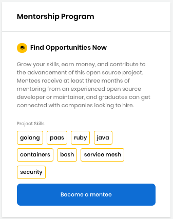

# Integrated Services for a Project

Integrated services for a project let you see additional information about a project.

**Note:** Integrated services are not available for Events and Travel Scholarships

**To view integrated services:** 

1. Open [CommunityBridge Funding](https://funding.communitybridge.org/).
2. Select **Projects and Mentorships.**
3. Select a project of interest, the project detail page shows the integrates services, which can help you gain insight into the project. Funding integrates with the following independent CommunityBridge services:

## Bug Bounty 

**Bug Bounty** shows the compensation for solving bugs and security vulnerabilities for projects that allocate funds to run a bug bounty program. You can see the metrics around program details, bounty amounts, bugs detected, and hackers paid, and so on. Anyone can view publicly disclosed bug overviews for the project, but maintainers have privileged access to the detailed full disclosure information. Project maintainers can Include a bug bounty service to address replicable defects and improve the security and robustness of their projects.

## Mentorship Program 

The **Mentorship** **Program** provides a mentorship matchmaking service that helps grow interested mentees into participating contributors in open source communities. This program connects mentorship candidates with projects; mentees with mentors; projects with donors to provide mentorship stipends; and mentorship graduates with potential job opportunities.

## Stacks 

**Stacks** shows crowd-sourced usage metrics about the project. These metrics show the total number of companies and users with their company logos and profile images as well as company and individual apps the project uses as part of their stack. This information is gathered from users who have voluntarily confirmed the use within their private enterprise or public community environments. Although there is no concrete guarantee of this data being accurate due to the voluntary nature of it, Stacks does provide indicators to funders about the adoption of the project and its impact across the industry at large.

## Vulnerability Detection 

**Vulnerability Detection** provides a scanning service to detect vulnerabilities in your project.

The Vulnerability Report shows the severity of vulnerabilities discovered in the project repositories. The National Vulnerability Database \(NVD\) provides CVSS scores for almost all known vulnerabilities,  classified into HIGH/MEDIUM/LOW severity for easy prioritization.

Project maintainers can hover over a severity level to log in to Vulnerability Detection and see upstream dependencies, security vulnerabilities, usage reports, and licensing details.

|  |  |
| :--- | :--- |

