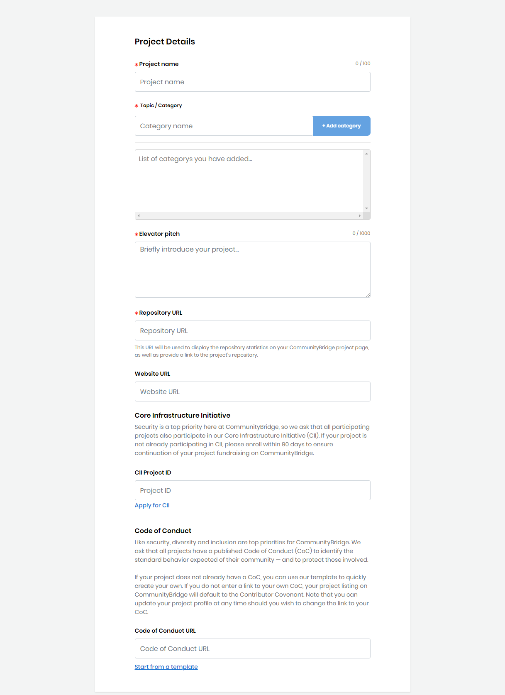
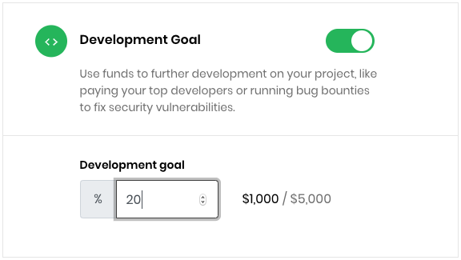
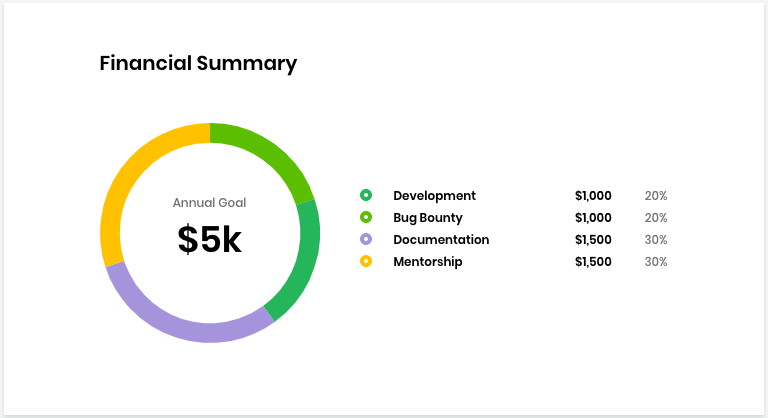

# Project Application Form

## Project Details 

The following table lists all the fields in the **Project Details** panel of the Project Application:

<table>
  <thead>
    <tr>
      <th style="text-align:left">Field Name</th>
      <th style="text-align:left">Description</th>
    </tr>
  </thead>
  <tbody>
    <tr>
      <td style="text-align:left"><b>Project Name</b>
      </td>
      <td style="text-align:left">
        
(Required) Name of the project.
           CommunityBridge supports one administrator per project who serves as the
          administrator of that project within Funding&#x2014;no one else can claim
          this project for Funding. This project name will appear on your project
          page.

        
<b>Note: </b>This name must be unique&#x2014;no other project can exist
          in Funding with the same name. However, funds of a different type can use
          the same name. For example, a Travel Scholarship fund and a Projects fund
          can use the same name.

      </td>
    </tr>
    <tr>
      <td style="text-align:left"><b>Topic / Category</b> 
      </td>
      <td style="text-align:left">(Required) Type of industry that relates to your repository. For example,
        the Cloud topic is appropriate for an Express Gateway project. Click in
        the field to open a list of names to choose from. Click
        after you select a category from the list.
         <b>Note:</b> The category/categories are reflected in the <b>List of categories you have added...</b> field
        after you add a category.</td>
    </tr>
    <tr>
      <td style="text-align:left"><b>Elevator pitch</b> 
      </td>
      <td style="text-align:left">(Required) Brief statement of why your project is important to support.</td>
    </tr>
    <tr>
      <td style="text-align:left"><b>Repository URL</b>
      </td>
      <td style="text-align:left">(Required) URL of the GitHub repository.
         CommunityBridge uses this URL to display the repository statistics on
        your project page, and to provide a link to the project&#x2019;s repository.
         <b>Note:</b> If you choose <b>Add GITHUB Repository </b>from the options
        while applying, your GitHub repository is automatically reflected in this
        field.</td>
    </tr>
    <tr>
      <td style="text-align:left"><b>Website URL</b>
      </td>
      <td style="text-align:left">(Optional) The Website address that you want to associate with the fund.</td>
    </tr>
    <tr>
      <td style="text-align:left"><b>CII Project ID</b>
      </td>
      <td style="text-align:left">
        
(Optional) The <a href="https://www.coreinfrastructure.org/programs/badge-program/">Core Infrastructure Initiative (CII) Badge Program</a> Project
          ID number, for example: 24.

        
The CII Badge Program is an open source secure development maturity model.
          Projects that have a CII badge showcase the project&#x2019;s commitment
          to security. Examples of criteria include basic open source development
          practices (website, open source license, and user engagement), use of change
          control tools, attention to quality (automated test suite), and focus on
          security (secure project delivery method, use of dynamic and static analysis
          tools, as appropriate for the project). Consumers of the badge are able
          to quickly assess which open source projects care about security-conscious
          development. Although participating in the CII Badge Program is optional,
          we encourage you to enroll in the program within the first 90 days from
          your application submission. The badge displays on your project dashboard
          to showcase your project&#x2019;s status and progress on security and other
          metrics.

        
Click <b>Apply for CII</b> to get a badge and CII Project ID number if your
          project does not have one. You answer a questionnaire to be awarded a Best
          Practices Badge and a CII Project ID if you are approved. A questionnaire
          snippet follows:

        

          
        

      </td>
    </tr>
    <tr>
      <td style="text-align:left"><b>Code of Conduct URL</b>
      </td>
      <td style="text-align:left">(Optional) An agreement that describes the rules of behavior for the members
        of the project. Specify a URL for your code of conduct or create a code
        of conduct by clicking <b>Start from a template</b>. A default <a href="https://www.contributor-covenant.org/version/1/4/code-of-conduct">Contributor Covenant</a> appears
        and you can use it as a template. Click <b>Add Custom Website</b> to add
        a website to your project by entering a website name and URL.</td>
    </tr>
  </tbody>
</table>

## Project Branding 

The following table lists all the fields in the **Project Branding** panel of the Project Application:

| Filed Name | Description |
| :--- | :--- |
| **Project Logo** | \(Optional\) A symbol or other design adopted by your organization that identifies your project. Click **Browse** to upload a file. Preview shows the logo that you uploaded. **Note:**  File type- JPG, PNG, SVG             File size- 2MB \(maximum\) |
| **Accent Color** | \(Required\) The hexadecimal number for the color that you want to use as your project brand, for example, \#008000 is green. Enter a **hexadecimal number** or click in the field to open the color picker. Use the picker by clicking inside the color field to pick a color. You can use the up/down arrows to refine the color by editing the color values. The gray field refreshes to match your selection. |

## Project Beneficiaries 

Beneficiaries are individuals who work on a project and then request reimbursement for their time and expenses. If your project participates in a Mentorship program that includes stipends for mentees, add these mentees as beneficiaries.

The following table lists all the fields in the **Project Beneficiaries** panel of the Project Application:

| Field Name | Description |
| :--- | :--- |
| **Name** | The name of the person who you want to designate as a beneficiary of funds. |
| **Email** | The email of the project beneficiary. |

After you enter the name and email address of a person, click **+Add beneficiary** to add the person to the list. To add more beneficiaries, click **+ Add beneficiary** and complete the fields that appear.

When you submit the project, and after the project is approved, the Linux Foundation finance team sets up individual Expensify accounts for each beneficiary. Then, each beneficiary receives an email notification from the finance team that includes a link to their Expensify account. Beneficiaries are invited to join the custom Expensify policy as part of their participation in CommunityBridge. After accepting the invitation, beneficiaries have access to the policy where they can submit expenses for [reimbursement](get-reimbursed.md) from CommunityBridge funds.

The finance team also works with the project administrator to set up a specific expense policy that applies to the project. All the beneficiary and project expenses are gated through the expense policy. For example, the policy might state a hotel price range that is acceptable for a beneficiary or a per diem food allowance. 

Only the project administrator can add or remove beneficiaries. The finance team is notified and adjusts the Expensify accounts accordingly.

## Project Funding Goal 

**Annual Funding Goal** is a total project funding goal amount for the year. The Total Project Funding amount is a sum of the individual goal amounts.

## Fund Distribution 

**Fund Distribution** enables goals for how you want to distribute funds in your project, and complete the fields that appear—see the example below. Enter a percentage of your Annual Funding Goal amount to designate towards the goal. You can use the up/down arrows to select a percentage also.  
Be clear to potential sponsors about how you intend to use the funds. You can designate funds towards different types of expenses such as Marketing and Travel. Goal amounts are targets not limits, so you can continue raising money beyond your goal amount. As you see progress in one or more goals, you can \(and should\) update the goals to reflect how you plan to utilize these additional funds.

The Mentorship Goal lets you opt in to the Mentorship program and allocate funds for it. For details, see [Opt In Your Project to the Mentorship Program](mentorship-program/opt-in-your-project-to-the-mentorship-program.md).

## Financial Summary 

The Financial Summary shows the annual financial goal and progress towards it by individual goal. It shows a distribution report based on your selection from the **Fund Distribution** panel.

## Terms and Conditions 

Select the checkbox

